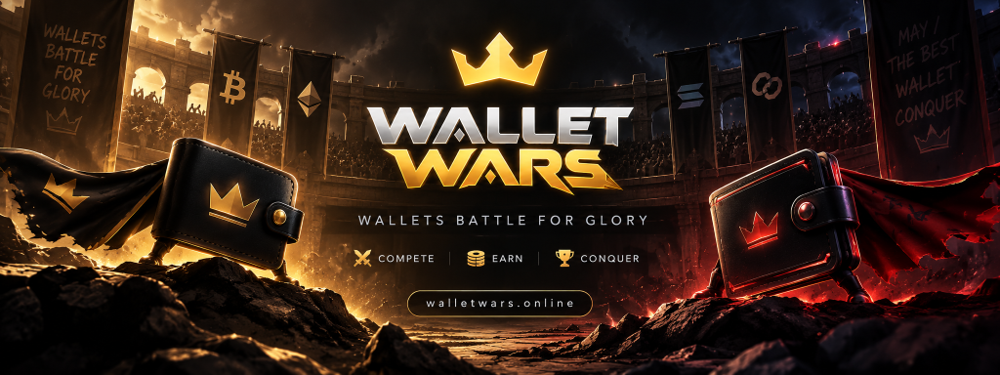
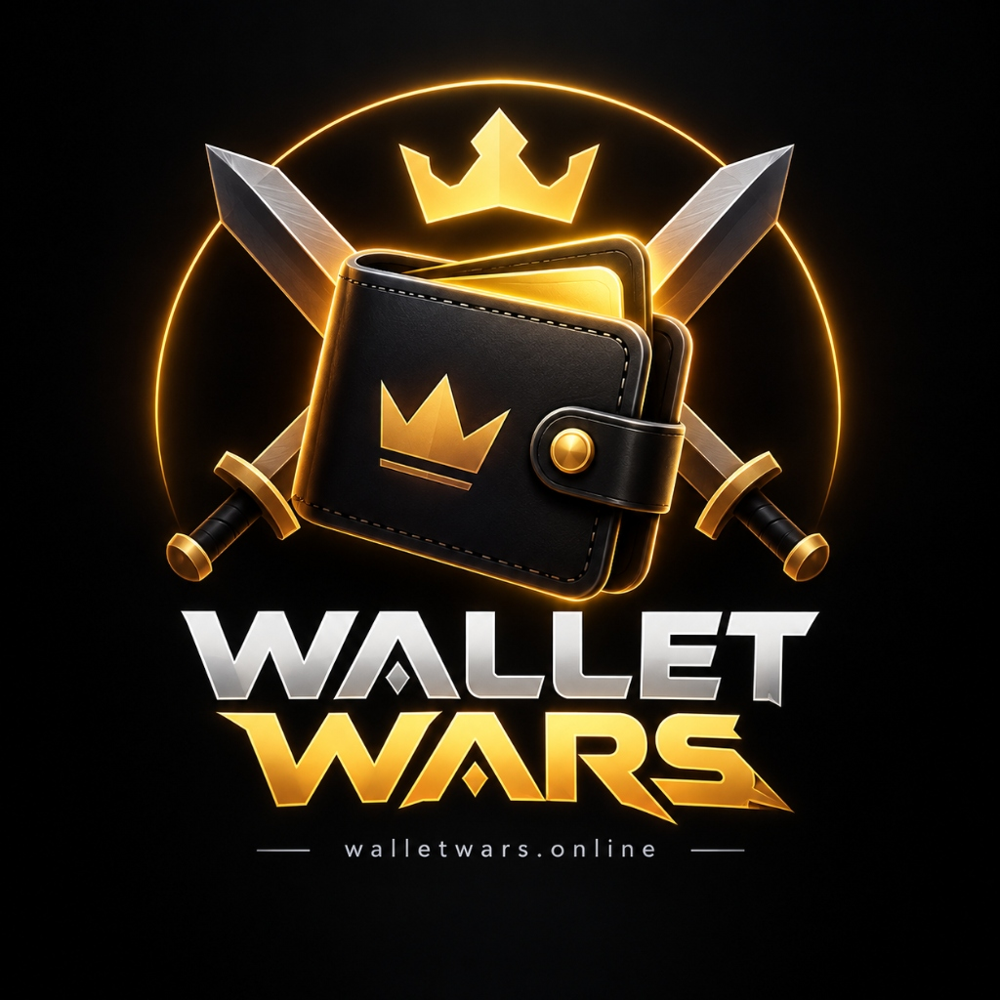

<p align="center">
  
</p>

<p align="center">
  
</p>

<h1 align="center">⚔️ WALLET WARS • ROBINHOOD EDITION ⚔️</h1>

<p align="center">
  <strong>Your Robinhood Portfolio Has a Fighter • Wallets Battle for Glory</strong><br>
  An on-chain tactical battle game that transforms Robinhood portfolios, trading history, and Web3 wallets into living crypto & stock gladiators.
</p>

<p align="center">
  <a href="https://walletwars.online"></a>
  <a href="https://robinhood.com"></a>
  <a href="#-tech-stack"></a>
  <a href="#-license"></a>
</p>

---

## 📖 Overview

**Wallet Wars: Robinhood Edition** brings retail trading culture directly into the combat arena. Every trader's habits on Robinhood—from 0DTE options gambles and margin leverage to seven-figure whale portfolios and steady $SPY index compounding—shape their warrior's RPG attributes, combat stats, and signature traits.

Link your Robinhood username (e.g. `@wsb_legend`), connect your Robinhood Web3 Wallet (`0x...`), or jump into the colosseum using instant starter demo traders to battle rival portfolios.

> *"Compete. Earn. Conquer."*

---

## 🟢 The Robinhood Portfolio Alchemy

Every warrior's combat specs are synthesized from portfolio and market telemetry:

| Robinhood Metric | RPG Stat Impact | Combat Dynamics |
|:---|:---|:---|
| 💵 **Buying Power & Portfolio Value** | **HP & Mass** | Heavy portfolios withstand massive drawdowns and command immense presence. |
| ⚡ **Trading Velocity & Day Trades** | **Speed & Agility** | High-frequency day traders strike at 9:30 AM market open before opponents react. |
| 🛡️ **Long-Term Holding (Boglehead)** | **Defense & Armor** | Years of holding $SPY / $VOO grant passive HP recovery and thick defensive shields. |
| 🪙 **Asset Diversity (Stocks + Crypto)** | **Intelligence & Magic** | Balanced holdings across BTC, ETH, NVDA, and TSLA unlock calculated tactical strikes. |
| 🎲 **Options Leverage & Volatility** | **Luck & Critical Damage** | Degens buying 0DTE calls deal wild RNG swings from 20% up to 250% critical damage. |

---

## 🥋 10 Robinhood Trader Archetypes

```
                             [ ROBINHOOD TRADING TELEMETRY ]
                                           │
        ┌──────────────────────────────────┼──────────────────────────────────┐
        ▼                                  ▼                                  ▼
  📈 0DTE OPTIONS DEGEN              🐋 ROBINHOOD WHALE              💎 DIAMOND HANDS
  "Gamma Squeeze"                    "Market Impact"                 "HODL Shield"
  High speed, triple crits           Massive HP, attack debuffs      Unbreakable shield & heal
        │                                  │                                  │
        ├──────────────────────────────────┼──────────────────────────────────┤
        ▼                                  ▼                                  ▼
  📊 INDEX MAXI                      🐕 DOGE / MEME KING             🩸 MARGIN SURVIVOR
  "Compound Interest"                "To The Moon"                   "Liquidation Rage"
  Continuous HP regen & armor        Absurd 20%–250% damage burst    +60% Attack when HP < 35%
```

<details>
<summary><strong>View All 10 Archetypes & Signature Abilities</strong></summary>

<br>

| Archetype | Icon | Specialty | Signature Ability | Playstyle |
|:---|:---:|:---|:---|:---|
| **0DTE OPTIONS DEGEN** | 📈 | Pure Adrenaline | **Gamma Squeeze**: Attacks 3 times in one round with explosive critical multipliers. | High risk, glass cannon. |
| **ROBINHOOD WHALE** | 🐋 | Unlimited Buying Power | **Market Impact**: Reduces opponent's attack by 35% for 2 rounds with sheer liquidity. | High HP colossus. |
| **DIAMOND HANDS** | 💎 | Unshakable Conviction | **HODL Shield**: Absorbs all incoming damage for 1 round and restores 25 HP. | Maximum defense tank. |
| **DOGE / MEME KING** | 🐕 | Robinhood Crypto | **To The Moon**: Unpredictable strike dealing between 20% to 250% damage. | High-luck jackpot striker. |
| **INDEX MAXI (BOGLEHEAD)** | 📊 | Compounding Math | **Compound Interest**: Regenerates 15 HP every turn with scaling armor. | Sustained battle attrition. |
| **MARGIN CALL SURVIVOR** | 🩸 | Drawdown Veteran | **Liquidation Rage**: When HP dips below 35%, attack power surges by +60%. | Enraged counter-attacker. |
| **ROBINHOOD GOLD TITAN** | 👑 | 5% APY Tier | **Cash Sweep**: Siphons 20 HP from opponent while boosting own attack power. | Balanced luxury combatant. |
| **PATTERN DAY TRADER** | ⚡ | 1-Minute Candles | **Bell Ringer**: Takes turn 1 initiative with a guaranteed double strike. | Relentless speed & tempo. |
| **PAPER HANDS** | 📄 | Panic Seller | **Stop Loss**: 40% chance to completely dodge an incoming attack. | Evasive hit-and-run. |
| **ALGO QUANT** | 🤖 | Automated Limits | **Limit Arbitrage**: Ignores 50% of opponent's defense with precision math. | Piercing executioner. |

</details>

---

## ⚡ Key Features

- 🏹 **Robinhood Profile Linker**: Enter your Robinhood handle (`@username`), Web3 wallet address (`0x...`), or Solana key to awaken your gladiator.
- 🎮 **Instant Demo Gladiators**: Jump right into combat without connecting a wallet using preset fighters (0DTE Degen, Whale, Doge King, Gold VIP).
- ⚔️ **Tactical Turn-Based Combat Engine**: Fast-paced simulations calculating initiative speed, damage mitigation, critical strikes, dodges, and round combat logs.
- 🏆 **Global WallStreetBets Leaderboard**: Track highest win rates, combat wins, and active win streaks.
- 🎯 **Daily Challenges & Achievements**: Complete trading-themed combat quests (*"Win a battle using 0DTE Degen against a Whale"*).
- 📱 **Robinhood Modern Design System**: Dark trading aesthetic styled with Robinhood Neon Green (`#00C805`), live market tickers, and sleek financial card elevations.

---

## 🏗️ Full-Stack Architecture

```
wallet-wars/
├── client/                     # React 18 + Vite Frontend Application
│   ├── src/
│   │   ├── components/         # BattleScreen, WarriorCard, StatBar, Navbar, Footer
│   │   ├── context/            # GameContext (Active Robinhood account, persistence)
│   │   ├── hooks/              # useWarrior, useBattle, useLeaderboard
│   │   ├── pages/              # Home, Arena, Battle, Warrior, Leaderboard, Achievements
│   │   ├── services/           # Typed REST API Client
│   │   └── utils/              # Archetype definitions, address formatters, stats
│   └── tailwind.config.js      # Robinhood green (#00C805), dark grays, luxury gold
├── server/                     # Node.js + Express + TypeScript Backend
│   ├── src/
│   │   ├── config/             # Database & environment configuration
│   │   ├── controllers/        # Wallet, Warrior, Battle, Leaderboard, Game
│   │   ├── models/             # Mongoose Schemas (Warrior, Battle, Challenge, Achievement)
│   │   ├── routes/             # REST API endpoints
│   │   ├── services/           # warriorGenerator.ts, walletAnalysis.ts, battleEngine.ts
│   │   └── scripts/            # seed.ts (Seeded Robinhood Arena Gladiators)
│   └── package.json
├── assets/                     # Brand identity (banner.png, logo.jpg)
└── vercel.json                 # Production serverless deployment configuration
```

---

## 🚀 Quick Start Guide

### 1. Prerequisites
- **Node.js** >= 18.0.0
- **npm** >= 9.0.0
- **MongoDB** (Local instance or free MongoDB Atlas URI)

### 2. Clone & Install

```bash
# Clone the repository
git clone https://github.com/Anurag12shukla/wallet-wars.git

# Enter project directory
cd wallet-wars

# Install all workspace dependencies
npm run install-all
```

### 3. Environment Configuration

Create `.env` in `server/`:

```bash
cp .env.example server/.env
```

Ensure `server/.env` includes:
```ini
PORT=5000
MONGODB_URI=mongodb://localhost:27017/wallet-wars
CLIENT_URL=http://localhost:5173
NODE_ENV=development
```

### 4. Seed Robinhood Gladiators (Optional)

Populate the arena with starter traders:

```bash
npm run seed
```

### 5. Launch Development Server

Run backend API and frontend concurrently:

```bash
npm run dev
```

- 🏹 **Frontend UI**: `http://localhost:5173`
- ⚙️ **Backend API**: `http://localhost:5000`
- 🩺 **API Health**: `http://localhost:5000/api/health`

---

## 📡 REST API Reference

| Method | Endpoint | Description |
|:---|:---|:---|
| `POST` | `/api/wallet/analyze` | Evaluate portfolio telemetry & synthesize fighter specs |
| `POST` | `/api/warriors` | Register or update gladiator profile |
| `GET` | `/api/warriors/:address` | Fetch a gladiator by Robinhood handle or wallet address |
| `GET` | `/api/warriors/opponents/find` | Find balanced arena opponents by ELO/level |
| `POST` | `/api/battles` | Execute a battle round simulation between 2 traders |
| `GET` | `/api/battles/:id` | Fetch verified battle history and combat log |
| `GET` | `/api/leaderboard` | Retrieve global leaderboard rankings |
| `GET` | `/api/game/daily-challenges` | Get current daily active quests |

---

## 📄 License

Distributed under the MIT License. See `LICENSE` for details.

---

<p align="center">
  Built with 🏹 for the <strong>Robinhood</strong> Community • Created by <a href="https://github.com/Anurag12shukla">Anurag Shukla</a>
</p>
